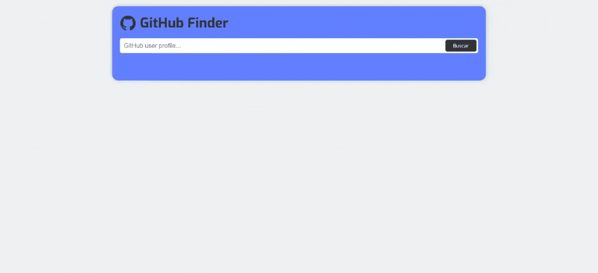

# Interactive Rating Component

<!-- ### Links -->
<!-- - [Solution]() -->
[View Website](https://pedrowfilho.github.io/fetch-github-finder/) 🖱️

## Visão Geral

### Desafio API GitHub

Este é um desafio do curso DevQuest - DevEmDobro que consiste em utilizar os conhecimentos adquiriros no módulo de JavaScript avançado para fazer requisições à API Github e renderizá-las na página.

### Habilidades/Técnicas

- JavaScript
- GitHub API
- CSS
- HTML
- Flexbox
- Responsividade
- Git

## Autor

Pedro Wagner - Front End Developer

